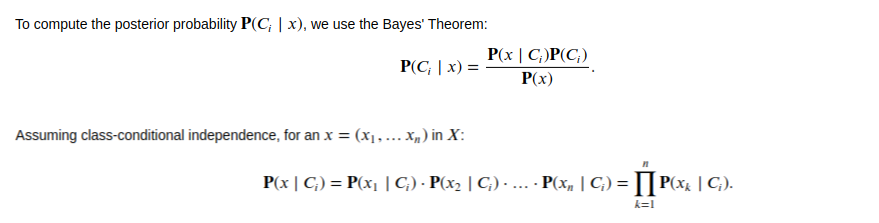
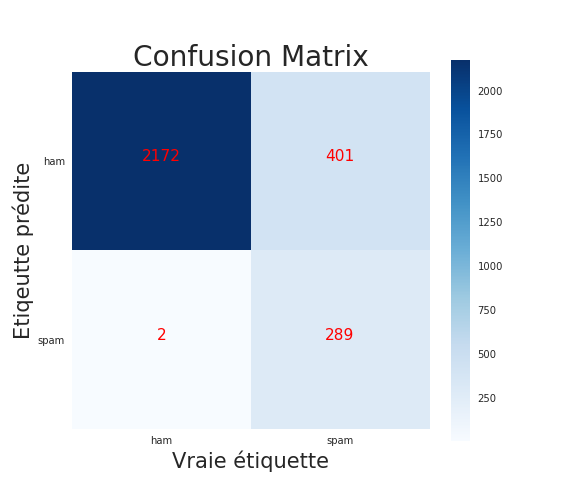

# SPAM Detector : Naïve Bayes Approach

In this github you find a python script for <strong> spam detection </strong> based on a <strong> Naïve Bayes approach.</strong> The Naïve Bayes theorem try to figure out a posterior probability base on prior probabiility. 

An email can be consider as a set of word and base on the word composition of a previous set of email we can builb a classifier  based Naïve Bayes Theorem to mesure the probability that any given email is an spam or ham.

# Method
<strong> Naïve Bayes </strong> Theorem is derive from the famous <strong> Bayes Theorem </strong> that give the posterior probability based on the prior probability of events. Let's suppose we have a set of sentences $X =$ { $x_1, x_2, x_3, . . . $} where every sentence $x_i$ contain a set of words $W_i = ${ $w_{i2} , w_{i2}, w_{i3}, . . .$}. Every sentence $x_i$ can be classify into two class $C_i$ for $i$ in {1, 2}. The probability of the sentence $x_i$ to be of class $C_j$ is given by : 

$$
P(C_j | x_i) = \frac{P(C_j \cap x_i)}{P(x_i)}
$$

with 

$$
P(x_i) = P( w_{i1} \cap w_{i2} \cap w_{i3} \cap . . . )
$$

The <strong> Naïve Bayes <strong> make an additiional asumption on the independance of words occurence to each other. more precisely it make the assumption that the words in sentences are independants to each other and in the word of probability this can be write as : 

$$
P(x_i) &= P( w_{i1} \cap w_{i2} \cap w_{i3} \cap . . . \cap w_{in} ) \\
       &= P(w_{i1}).P(w_{i2}).P(w_{i3}). . .P(w_{in})\\
       &= \prod_{j=1}^{j=n} P(w_{ij})
$$

Thank to Bayes Theorem
## Result 
Here  we represent the confusion matrix of the Naïve Bayes model 

## Discussion

As reveal by the confusion matrix, the model is not that good as expected. In fact the <strong> Naïve Bayes </strong> approach give a very good classification for <strong> HAM Email ( good mail ) </strong> but give a very bad result for <strong> SPAM Email </strong>; the one we are interest in. This can be explain by the assumption use behind this model : <strong> The Word indepence frequency </strong>

In fact, in real life situation it's obvious that the word are dependant to each other and can be consider independently. In fact if i write a sentence and i start writing <strong>" Yesterday i . . ." </strong>, it's obvious that the next word can't be any random word, it have to be a verb or a specific type of verb depending of the meaning we want to give to the sentence. So the word are dependent to each other and can't be consider as independents.

There are many other limitation of this model who can explain the result we get . . .

## Author
- Name : <strong> Brice KENGNI ZANGUIM </strong>
- Email : <strong> kenzabri2@yahoo.com </strong>