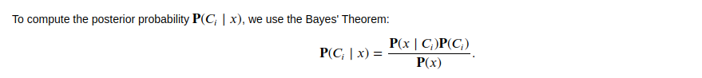

# SPAM Detector : Naïve Bayes Approach

In this github you find a python script for <strong> spam detection </strong> based on a <strong> Naïve Bayes approach.</strong> The Naïve Bayes theorem try to figure out a posterior probability base on prior probabiility. An email can be consider as a set of word and base on the word composition of a previous set of email we can builb a classifier  based Naïve Bayes Theorem to mesure the probability that any given email is an spam or ham.

# Method
<strong> Naïve Bayes </strong> Theorem is derive from the famous <strong> Bayes Theorem </strong> that give the posterior probability based on the prior probability of events. 

Thank to Bayes Theorem
## Result 
Here  we represent the confusion matrix of the Naïve Bayes model 

## Discussion

As reveal by the confusion matrix, the model is not that good as expected. In fact the <strong> Naïve Bayes </strong> approach give a very good classification for <strong> HAM Email ( good mail ) </strong> but give a very bad result for <strong> SPAM Email </strong>; the one we are interest in. This can be explain by the assumption use behind this model that  the occurence 
